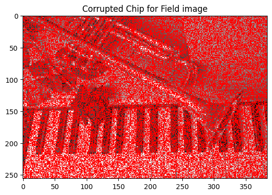
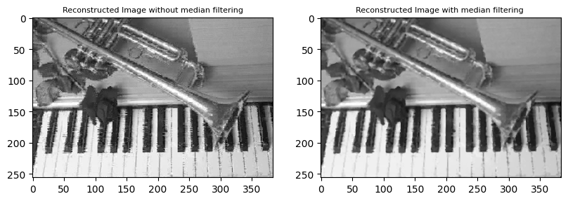

# Compressed Sensing Image Recovery

## Introduction
This project focuses on applying regularized sparse regression for complete image recovery from sparse pixel data, addressing challenges in compressed sensing and image corruption. It aims to make advanced image processing techniques more accessible.

## Problem Statement
The goal is to reconstruct high-fidelity images from limited and incomplete data, enhancing image quality in applications like medical diagnostics, satellite imaging, and digital restoration.

## Image Reconstruction Process
The process involves image corruption, applying the basis vector, LASSO application, and median filtering. Detailed steps include setting up corruption parameters, creating corrupted blocks, and uniform application of corruption across image blocks.

## Testing
We applied the image reconstruction process on test images such as a field image, assessing the improvement in image quality and detailing.

## Conclusion and Insights
In the scope of this project, the application of a regularized regression approach, with a particular emphasis on LASSO, was profoundly effective. This can be proved by the image reconstruction results. This methodology significantly contributed to the restoration of image clarity and precision, particularly notable in instances of sparse and significantly corrupted datasets 
(for S= 10,20,30) in particular. The incorporation of regularization and choosing the optimal value for reconstruction of the image allowed for a substantial reduction in noise interference and effectively counteracted the risk of overfitting. This was particularly evident in the stark improvement of image details and overall fidelity compared to traditional reconstruction 
methods. The success of this approach underscored the value of regularization in extracting meaningful information from highly sampled (corrupted) or incomplete data. Which can be caused due to design or sampling

## References
Reference and Citations
1. https://en.wikipedia.org/wiki/Compressed_sensing#:~:text=Compressed%20sensing%20can%20be%20used,optical%20and%20millimeter%
2Dwave%20holography.
2. https://en.wikipedia.org/wiki/Underdetermined_system
3. https://www.geeksforgeeks.org/basis-vectors-in-linear-algebra-ml/
4. Basic Image Filtering Operations by E.R. DAVIES, in Machine Vision (Third Edition), 2005
5. https://blog.minhazav.dev/lowpass-highpass-band-reject-andband-pass-filter/#:~:text=one%20of%20them.-,Types%20of%20filters,Example%3A%20Sharpening%20mask%20filters
6. https://www.datacamp.com/tutorial/tutorial-lasso-ridge-regression 
7. https://builtin.com/data-science/l2-regularization
8. OpenCV (cv2): Bradski, G. (2000). The OpenCV Library. Dr. Dobb's Journal of Software Tools.
9. NumPy: Harris, C. R., Millman, K. J., van der Walt, S. J., et al. (2020). Array programming with NumPy. Nature, 585(7825), 357-362. 
https://numpy.org/citing-numpy/
10. Matplotlib: Hunter, J. D. (2007). Matplotlib: A 2D graphics environment. Computing in Science & Engineering, 9(3), 90-95. 
https://matplotlib.org/stable/users/project/citing.html
11.  Scikit-Learn (sklearn): Pedregosa, F., Varoquaux, G., Gramfort, A., et al. (2011). Scikit-learn: Machine Learning in Python. Journal of 
Machine Learning Research, 12, 2825-2830. https://scikit-learn.org/stable/about.html#citing-scikit-learn
12.  SciPy (specifically SciPy. Signal for medfilt): Virtanen, P., Gommers, R., Oliphant, T. E., et al. (2020). SciPy 1.0: Fundamental Algorithms 
for Scientific Computing in Python. Nature Methods, 17, 261-272. https://www.nature.com/articles/s41592-019-0686-2
13.  Math (standard Python library): Python Software Foundation. Python Language Reference, version 3.x. 
https://docs.python.org/3/library/math.html
14. Random (standard Python library): Python Software Foundation. Python Language Reference, version 3.x. 
https://docs.python.org/3/library/random.html
15. Tibshirani, R. (1996). Regression Shrinkage and Selection via the Lasso. Journal of the Royal Statistical Society. Series B 
(Methodological), 58(1), 267-288
16. Hastie, T., Tibshirani, R., & Friedman, J. (2009). The Elements of Statistical Learning: Data Mining, Inference, and Prediction. New York: 
Springer.
17. Candès, E. J., Romberg, J. K., & Tao, T. (2006). Robust uncertainty principles: Exact signal reconstruction from highly incomplete 
frequency information. IEEE Transactions on Information Theory, 52(2), 489-509.
18. ECE-580, Duke University Class Notes
